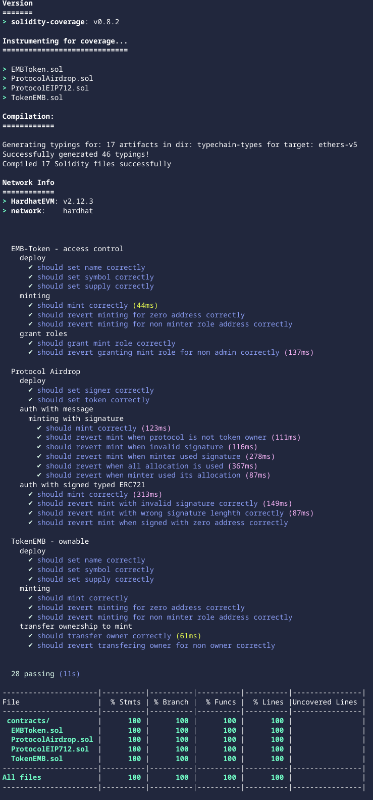

# AIRDROP

ECDSA and EIP-712 signatures dependent ERC20 token airdrop.

Instead of minting and distributing all the tokens in a single transaction (which might not be possible if the number of minters is large), the Protocol authenticate minters using ECDSA and EIP712 - structured signatures

## Flow

1. Create a centralized server and database that holds all the addresses that are allowlisted.
2. When a wallet tries to initiate a mint of the airdrops protocol, send the wallet address to the server.
3. The server checks if the address has been allowlisted and if it has, it signs the wallet address with a private key that is known only to the project’s creator.
4. The server returns the signed message to the client (or website) and this in turn, is sent to the smart contract.
5. The contract’s mint function verifies that the message sent was indeed signed by the wallet controlled by the owner. If the verification succeeds, minting is allowed.
6. The signed message is stored in a mapping to prevent it from being used more than once or by multiple wallets.

## ProtocolAirdrop Contract

1. is deployed with:

   - hardcoded with non changable signer and ERC20 token
   - max airdrop supply allowed
   - max token units per drop

2. requires owner's right to be granted by the TokenEMB contracts owner - in order to mint
3. mints token using either valid `ECDSA` or `EIP-712` signatures

## Usage

```
npm install hardhat
REPORT_GAS=true npx hardhat test
npx hardhat coverage
npx hardhat node
npx hardhat run scripts/deploy.ts
```

## Deployments

- `TokenEMB` Deployed and Verified on [goerli](https://goerli.etherscan.io/address/0x57bD87B81514b681dCe682491d573f297a486d90#code)
- `ProtocolAirdrop` Deployed and Verified on [goerli](https://goerli.etherscan.io/address/0x8445BBa6951Aa98ae86A0A05270c25d36b290320#code)

- with [owner](https://sepolia.etherscan.io/address/0x741e0608906B74B8754a99413A7374FdE7B9779a)
- with [signer](https://sepolia.etherscan.io/address/0x741e0608906B74B8754a99413A7374FdE7B9779a)

## coverage

<br/>
<p align="center">

</a>
</p>
<br/>

## TODO

1. test zero contract signer attack
2. test re-entrancy attack
3. add Merkle Proof validation library
